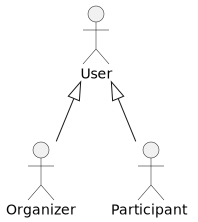
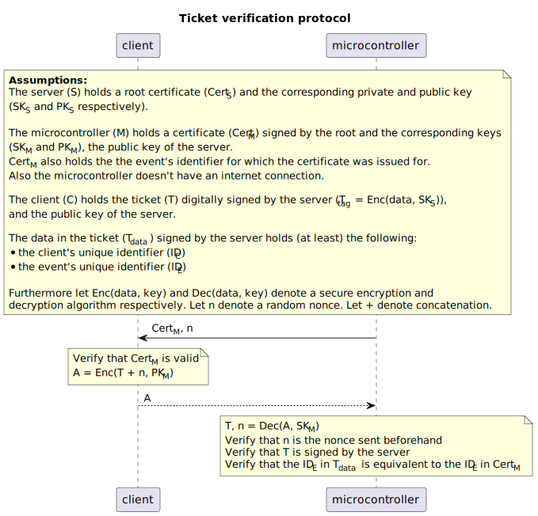
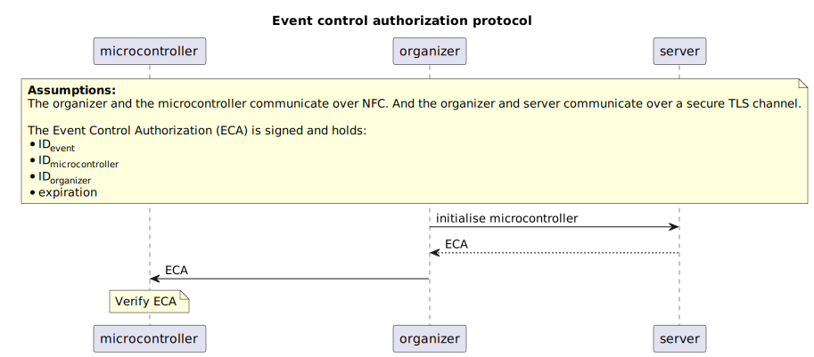
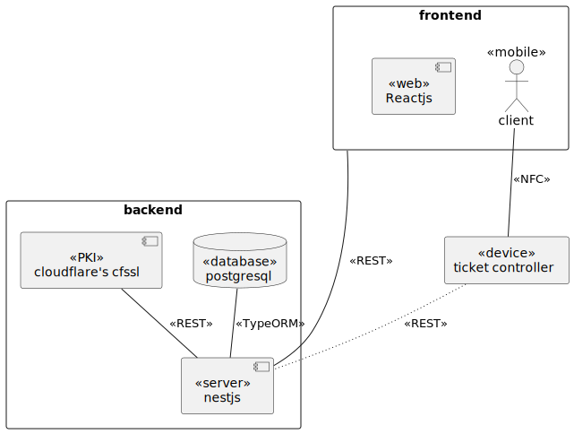

# Project

## Team
| Name                        | Role                        |
| --------------------------- | --------------------------- |
| Bicok Norbert               | backend                     |
| Gatyó Bence                 | test, web frontend          |
| Molnár Dániel               | mobil frontend              |
| Rudnay Roland               | project manager, frontend   |
| Sulyok Levente              | backend, devops             |
| Szabó Ákos                  | hardware                    |
| Uhljár Balázs               | mobil frontend, mobil nfc   |

## Actor model

## Functional Requirements
| ID    | Actor       | Name                            | Priority | Cost     | Version  |
| ----- | ----------- | ------------------------------- | -------- | -------- | -------- |
| 1.1   | all         | create user                     | H        | 3        |          |
| 1.2   | all         | change user data                | M        | 1        |          |
| 1.3   | all         | change user password            | M        | 1        |          |
| 1.4   | all         | forgot user password            | M        | 3        |          |
| 1.5   | all         | delete user                     | L        | 2        |          |
| 1.6   | all         | login user                      | H        | 2        |          |
| 1.7   | all         | logout user                     | H        | 1        |          |
| 2.1   | organizer   | create event                    | H        | 3        |          |
| 2.2   | organizer   | change event                    | M        | 2        |          |
| 2.3   | organizer   | delete event                    | L        | 1        |          |
| 2.4   | participant | buy ticket (basket)             | H        | 8        |          |
| 2.5   | participant | view basket                     | M        | 3        |          |
| 2.6   | participant | view bought tickets             | M        | 2        |          |
| 2.7   | participant | activate ticket                 | H        | 13       |          |

## Ticket Management

### Preambel
The following assumptions apply for all further protocols and architecture regarding ticket management:
- The backend system provides Public Key Infrastructure (PKI) functionalities to manage tickets
- The backend has a root certificate which is used to sign certificates of microcontrollers and tickets (this can be a certificate on the backend server or a certificate signed by a higher authority, in the beginning the chain consists of only 2 certificates but this can be extended).
- The microcontroller is installed before being supplied to a trusted organizer with a certificate signed by the root. This certificate holds infromation about the organizer (name, address etc.) and a unique identifier of the microcontroller used for tracking.
- The microcontroller comes pre-installed with the root certificate

### Ticket Verification Protocol
The ticket verification protocol is based on the TLS handshake protocol. The server digitally signes each bought ticket to ascertain its authenticity.
The client can verify that the certificate sent by the microcontroller is a valid certificate issued by the server by going through the chain of certificates until it reaches the root
certificate. The client then encrypts its ticket with the public key of the microcontroller's certificate (assuming the ticket was bought for the event of the organizer present in the certificate) and sends it to the microcontroller.
The microcontroller than verifies that the ticket is authentic (i.e. signed by the root certificate) and that the ticket was issued for the event that
the microcontroller's is set to control (see [Microcontroller Configuration](#MCC).

#### Security Concerns
##### Malicious Microcontroller
Assumig that the certificate of a microcontroller is signed in a secure way and issued for a certain organizer no malicious microcontroller
can create a false certificate that is accepted by the client. The client will see that the certificate is invalid immediately and will not send their ticket.
##### Malicious Client
The tickets are signed by the private key of the root and assuming that the root's private key is kept safely no malicious user can create a fake ticket for an arbitrary event.
##### Malicious Third Party
The ticket is encrypted with the microcontroller's public key therefore only the microcontroller who generated its private/public key can decipher the ticket.
##### Replay Attacks
Consider the scenario where the microcontroller only sends it certificate to the client. The client will encrypt its ticket using the public key within the certificate.
This cipher message is always the same for the same ticket, therefore a malicious eavesdropper can copy the cipher message and send it to the microcontroller and gain access.
This replay attack can be mitigated by a randomly generated nonce that is different for each client that wants to send their message. Therefore the cipher message is
different for the same ticket as well and no eavesdropper can replay it to the microcontroller without the microcontroller noticing.

### <a name="MCC">Microcontroller Configuration</a>
At first the microcontroller rejects all tickets and can be configured to accept tickets for a certain event. The process of authorizing the microcontroller to validate tickets for a certain event
is initiated by the organizer who hosts said event. The server then creates a Event Control Authorization (ECA) which holds among other things the unique identifier of the event,
the unique identifier of the microcontroller, information about the organizer and an expiration date. The digitally signed ECA is then sent to the microcontroller through the organizer
and is verified by the microcontroller which then on accepts tickets for the authorized event.

## Deployment Diagram

